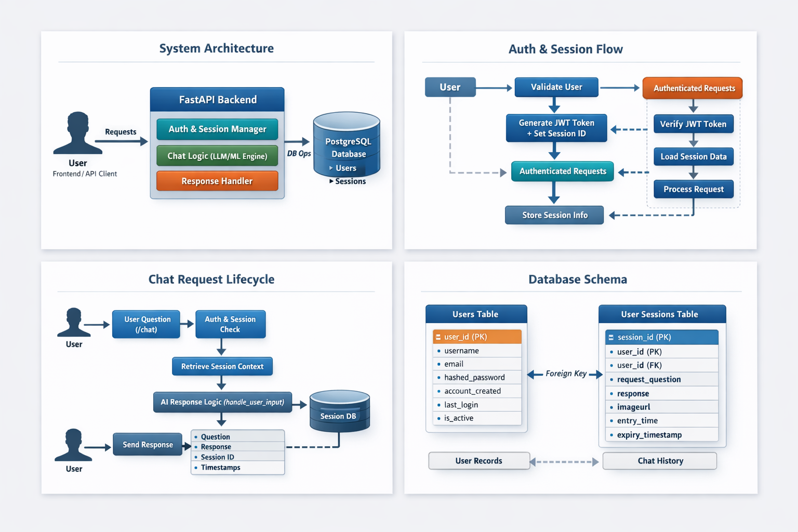
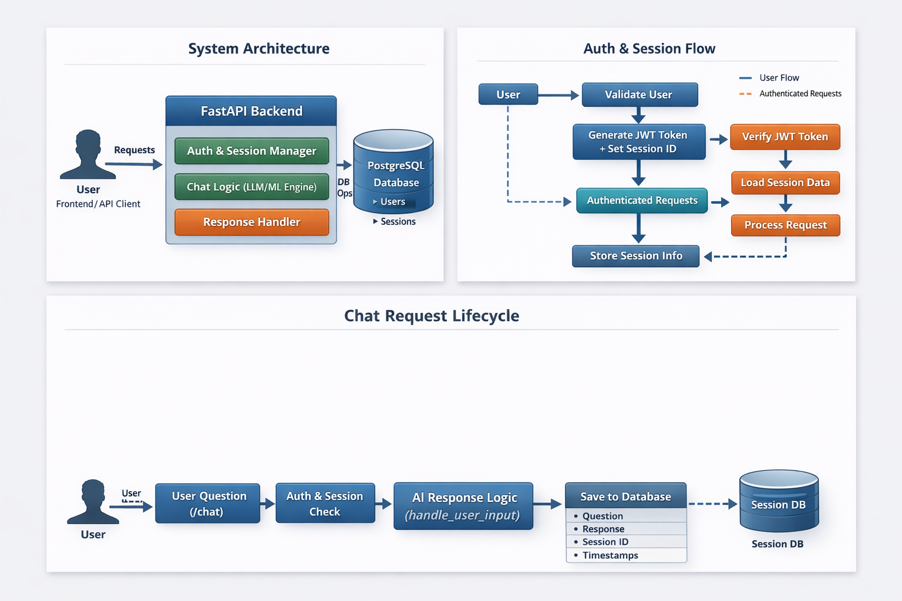

---

```markdown


# 🧠 Session-Aware AI Chatbot Backend (FastAPI + PostgreSQL)

A **production-ready, session-aware AI chatbot backend** built using **FastAPI**, **JWT authentication**, **server-side sessions**, and **PostgreSQL**.  
The system is designed to **remember user context across conversations**, securely manage users, and persist chat history for analytics and future intelligence.

> ⚠️ This repository focuses on **backend architecture, authentication, session handling, and persistence logic**.  
> AI inference / model logic is abstracted inside `handle_user_input()` and can be connected to any LLM or analytics engine.

---

## 🚀 Why This Project Stands Out

Unlike basic chatbot demos, this project demonstrates:

- ✅ **Real authentication (JWT + sessions)**
- ✅ **Persistent conversation memory**
- ✅ **Database-backed session tracking**
- ✅ **Production-ready FastAPI structure**
- ✅ **Secure password hashing**
- ✅ **Scalable API architecture**

This is how **real chat systems** are built in industry.

---


```

Client (UI / Postman)
|
v
FastAPI Backend
├── Authentication (JWT + Sessions)
├── Chat API (/chat)
├── Session Context Manager
├── AI Logic Layer
└── PostgreSQL Database

```

Each user interaction flows through:

**Authentication → Session Validation → AI Processing → Persistence**

---

## 🔐 Authentication & Security Design

### Authentication Flow


- Users log in via `/token`
- Passwords are stored using **bcrypt hashing**
- A **JWT token** is issued containing:
  - `username`
  - `session_id`
- Token expiration handled securely

### Session Management

- Each user gets a **persistent session_id**
- Sessions are stored server-side
- Session context is reused across requests
- Supports **multi-conversation continuity**

---

## 💬 Chat Flow (Core Logic)


1. User sends a question to `/chat`
2. JWT token is validated
3. Session ID is extracted
4. Previous conversation context is retrieved
5. `handle_user_input()` processes the query
6. Response + metadata saved to PostgreSQL
7. Response returned to user

This design enables:

- 🧠 Context-aware responses  
- 📊 Analytics on chat history  
- 🔁 Long-running conversations  

---

## 🗄️ Database Design (PostgreSQL)


### Users Table

Stores registered users and authentication metadata.

**Key fields:**
- `username`
- `hashed_password`
- `email`
- `last_login`
- `is_active`

### User Sessions Table

Stores chat history and session context.

**Key fields:**
- `user_id`
- `session_id (UUID)`
- `request_question`
- `response`
- `entry_time`
- `expiry_timestamp`

This enables:

- Session-based memory
- Time-bound context retention
- Easy cleanup & scaling

---

## 📁 Project Structure

```

chatbot-project/
├── app/
│   ├── main.py              # FastAPI entry point
│   ├── database.py          # SQLAlchemy setup
│   ├── models.py            # Database models
│   ├── auth.py              # JWT & password hashing
│   ├── dependencies.py      # DB & auth dependencies
│   ├── utils.py             # Token helpers
│   ├── routers/
│   │   ├── login.py
│   │   ├── logout.py
│   │   └── chatbot.py
│   └── static/
├── templates/
│   └── login.html
├── graphs/                  # Generated visuals (optional)
├── requirements.txt
├── .env                     # Secrets (excluded from git)
└── README.md

````

Clean, modular, and **scales easily**.

---

## 🧠 Design Decisions & Trade-offs

### Why FastAPI?
- Async support
- High performance
- Automatic OpenAPI docs
- Production-friendly

### Why JWT + Sessions?
- JWT → stateless authentication
- Sessions → persistent conversational memory  
**Best of both worlds.**

### Why PostgreSQL?
- Strong consistency
- JSON + relational support
- Easy analytics & reporting

---

## 🔥 What I Learned From This Project

- Designing **session-aware APIs**
- Implementing **secure authentication flows**
- Structuring FastAPI projects for production
- Managing **stateful AI interactions**
- Handling real-world backend concerns (expiry, persistence, security)

This was my **first full-fledged backend chatbot system**, and it taught me how production AI services are actually built.

---

## 🚧 Future Improvements

- 🔹 Role-based access (Admin / User)
- 🔹 Redis for session caching
- 🔹 Vector database for semantic memory
- 🔹 Rate limiting & monitoring
- 🔹 Dockerized deployment
- 🔹 Streaming responses (WebSockets)

---

## 🧪 How to Run Locally

```bash
pip install -r requirements.txt
uvicorn app.main:app --reload
````

Access API docs:

```
http://localhost:8112/docs
```

---

## 🏁 Final Notes

This project demonstrates **real backend engineering**, not just AI prompts.
It’s suitable for roles involving:

* Backend Engineering
* AI Platform Engineering
* Data Engineering
* Applied ML Systems

```

---

